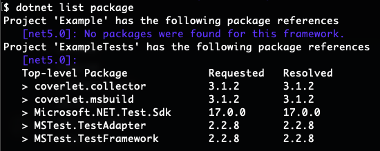
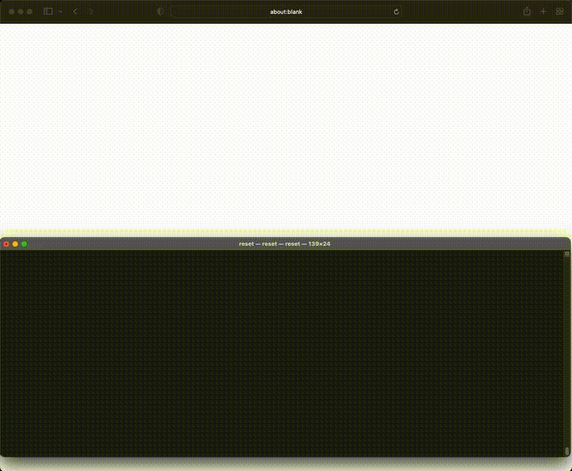
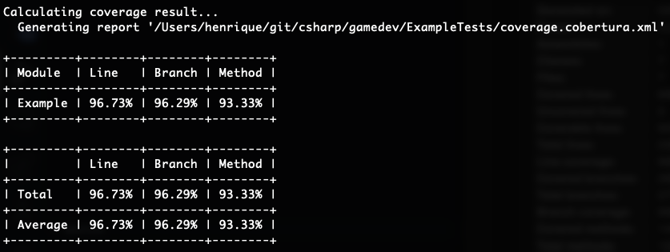
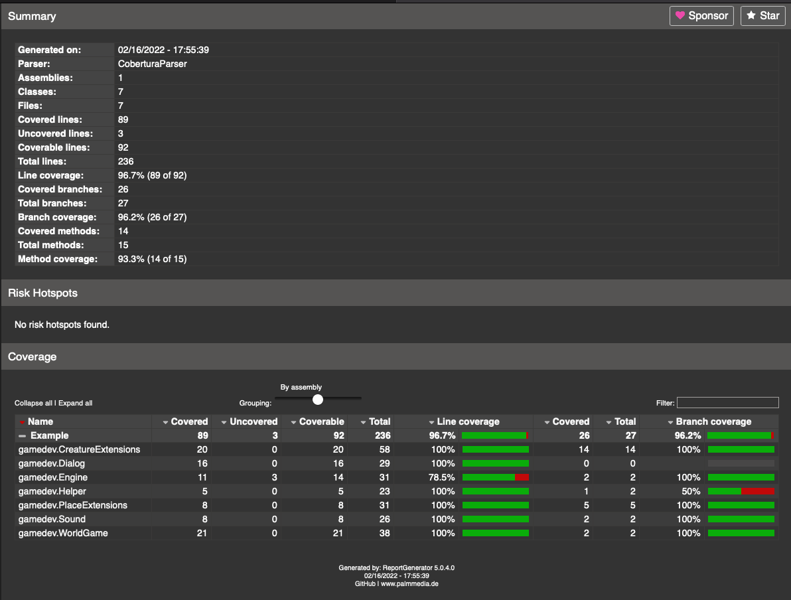
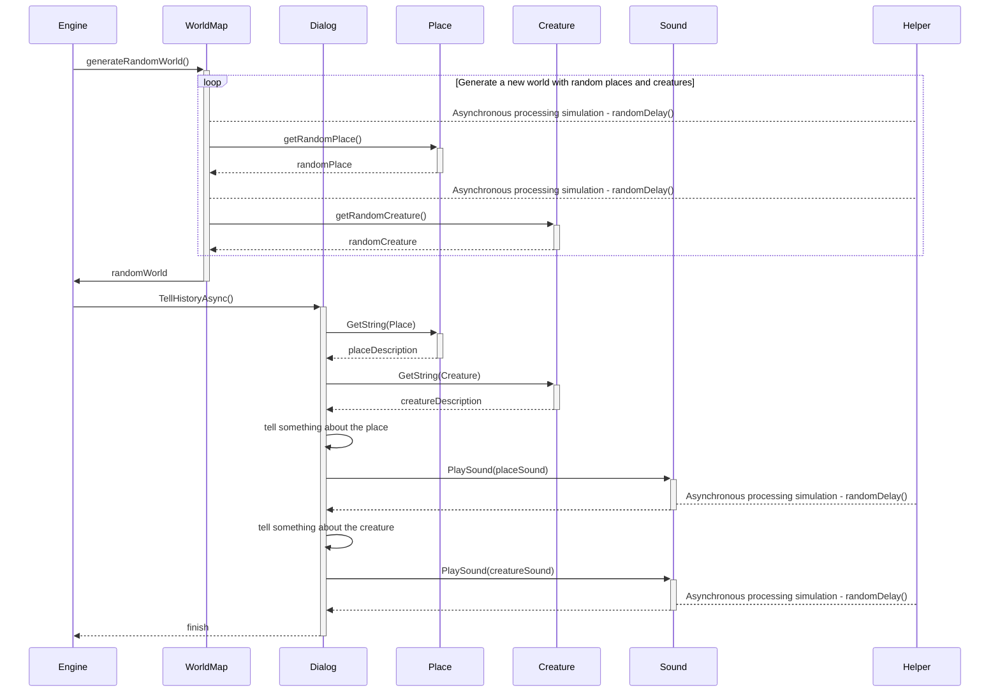

# GameDev

- [Project details](#project-details)
- [Technical](#technical)
  - [Dependencies](#dependencies)
- [play the game](#play-the-game)
- [Testing](#testing)
  - [Coverage](#coverage)
- [Sequence Diagram](#sequence-diagram)

## Project details

A storytelling game, where an imaginary world with 3 randomly generated locations featuring fantastic animals and an excellent script.

## Technical

- Language: C#
- Framework: .NET 5.0
- Environment used for development and testing:
  - Platform: Mac (M1)
  - OS: macOS Monterey (12.1)

### Dependencies

Use the command below to list all the libraries used in the solution:

```sh
dotnet list package
```

Output:




## play the game

> Remember to download the project's dependencies before starting it, using the command: `dotnet restore` 

Using the command below to start the game:

```sh
dotnet run --projec Example                                       
```

## Testing

Execute the command below to run all tests:

```sh
dotnet test
```

### Coverage

Before execute the steps below, needs to install the report generator:

```sh
dotnet tool install -g dotnet-reportgenerator-globaltool
```

Now, generate run all tests and collect the coverage data:
 
```sh
dotnet test /p:CollectCoverage=true /p:CoverletOutputFormat=cobertura
```

Finally, generate the HTML coverage report:

```sh
reportgenerator \
-reports:"$PWD/ExampleTests/coverage.cobertura.xml" \
-targetdir:"coveragereport" \
-reporttypes:html
```

Output:



> For more details about how to generate test coverage report, access the official Microsoft [documentation](https://docs.microsoft.com/en-us/dotnet/core/testing/unit-testing-code-coverage?tabs=linux).

The project presents the following coverage:

- Console



- HTML




## Sequence Diagram 

Diagram containing game events:


